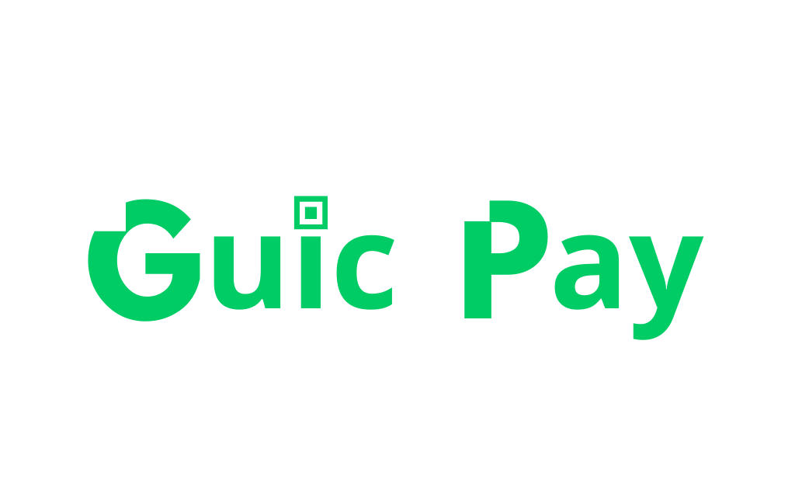
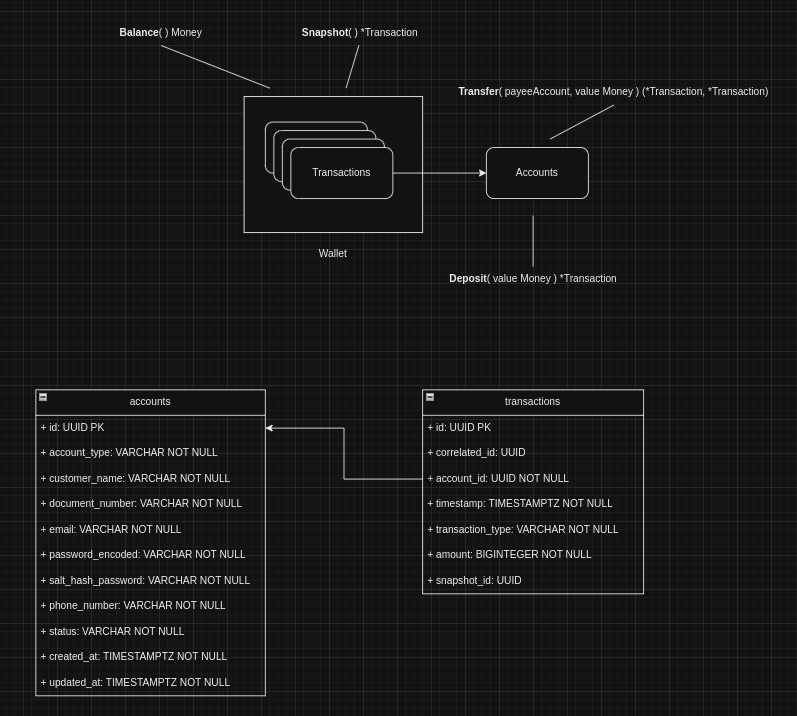
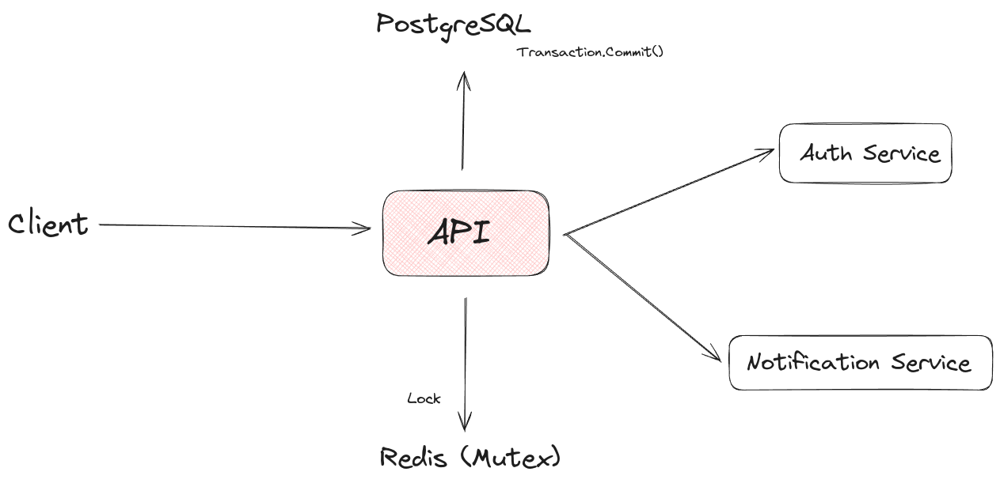
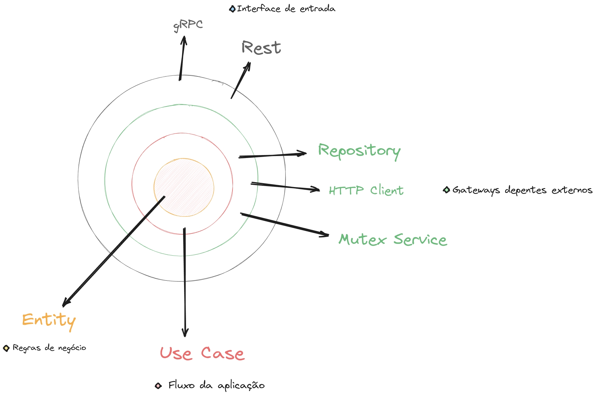

# GuicPay Simplificado - Desafio PicPay Backend

Este projeto é uma implementação simplificada do backend do PicPay, desenvolvido como parte do desafio proposto pelo [PicPay](https://github.com/PicPay/picpay-desafio-backend).

<div align="center">



</div>

## Stack 🔋

- **[Golang](https://go.dev/)**: Linguagem de programação, compilada, rápida, multi-paradigmas e concorrente.
- **[PostgreSQL](https://www.postgresql.org/)**: Banco de dados SQL utilizado para armazenar dados persistentes, usufruindo da capacidade de transações atômicas garantindo consistência.
- **[Redis](https://redis.io/)**: Sistema de armazenamento em cache atuando como um serviço de lock distribuído.
- **[DDD](https://www.zup.com.br/blog/domain-driven-design-ddd) (Domain-Driven Design)**: Metodologia para organizar o código em torno das regras de negócio, onde a modelagem do problema é o mais importante.
- **[Clean Architecture](https://blog.cleancoder.com/uncle-bob/2012/08/13/the-clean-architecture.html)**: Estrutura de código que enfatiza a separação de responsabilidades e a independência das camadas e não dependendo de framework.


## Modelagem de Domínio

<div align="center">



</div>

A imagem acima ilustra a modelagem de domínio do GuicPay simplificado. Cada entidade e sua relação refletem a estrutura fundamental do sistema.


## Arquitetura do Sistema

<div align="center">



</div>

A arquitetura do sistema é projetada para ser modular e escalável. Cada camada tem uma responsabilidade específica, facilitando a manutenção e o desenvolvimento contínuo.


## Clean Architecture

<div align="center">



</div>

A implementação do GuicPay Simplificado segue os princípios da Clean Architecture. Essa abordagem enfatiza a separação de interesses, facilitando a compreensão do código, a manutenção e a evolução do sistema.


## Como rodar o projeto 🚀

```sh
make docker-run
```

### Health Check

```sh
curl http://localhost:8080/ping
```


## Documentação 

Para acessar a documentação OpenAPI basta acessar a rota `/docs/` .

